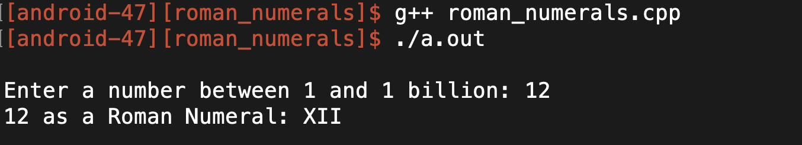
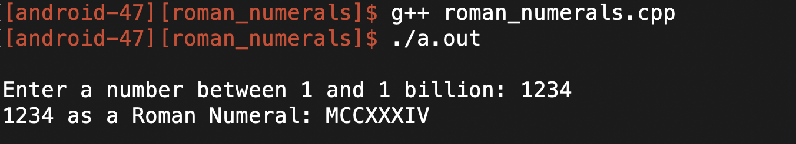
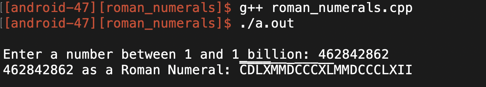

# Roman Numeral Calculator

### FEATURES
* Accurately converts an unsigned integer to it's Roman numeral value
* Unsigned integer can range from 1 and 1 billion, inclusively

## GAMEPLAY
### 12 as a Roman numeral

### 1,234 as a Roman numeral

### 462,842,862 as a Roman numeral



### DESCRIPTION
This program acts as a calculator. The input for this program is an unsigned integer between 1 and 1 billion (inclusive) from the user and outputs the number as a Roman numeral. 

### ROMAN NUMERAL KEY
I = 1  
V = 5  
X = 10  
L = 50  
C = 100  
D = 500  
M = 1,000  

Note: There is ONE horizontal lines above each Roman numeral  
V̅ = 5,000  
X̅ = 10,000  
L̅ = 50,000  
C̅ = 100,000  
D̅ = 500,00  
M̅ = 1,000,000  

Note: There are TWO horizontal lines above each Roman numeral  
V̿ = 5,000,000  
X̿ = 10,000,000  
L̿ = 50,000,000  
C̿ = 100,000,000  
D̿ = 500,000,000  
M̿ = 1,000,000,000  

### STEPS ON HOW TO COMPILE AND RUN THE PROGRAM  
1. Compile the program using C++ 11 by entering the following into the terminal command line  

```
g++ -std=c++11 roman_numerals.cpp
```

2. Run the program by running the executable file by entering the following line into the terminal command line:

```
./a.out
```

### KNOWN LIMITATIONS
* No error handling
* For numbers 5,000,000 and above, the two horizontal lines above the Roman numeral are difficult to see